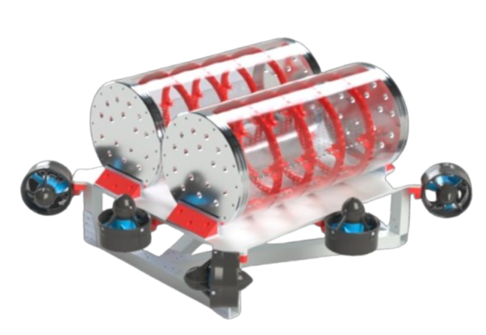

<p align="center">
    
</p>
<h1 align="center">Guppy!</h1>
<p align="center">
    
    
    
</p>

Home to the ROS 2 code that runs Guppy: [Palouse RoboSub](https://robosub.eecs.wsu.edu/)'s 2026 AUV for the international RoboSub competition.

## Getting Started

### Installation
To install, run the following on a brand new [Ubuntu 24.04](https://ubuntu.com/blog/tag/ubuntu-24-04-lts) installation:

```bash
sudo apt install -y curl
curl https://raw.githubusercontent.com/PalouseRobosub/guppy/refs/heads/main/util/bootstrap.sh | bash

# to install the GNCea simulator:
git clone https://github.com/palouserobosub/gncea
```

This runs the [`utils/boostrap.sh`](./utils/bootstrap.sh) script. If you do not use the install script, please be sure to *clone the repo recursively* with `--recurse-submodules` for all of the vendor packages.

### Building
```bash
cd ~/guppy # (or ~/gncea for sim)
colcon build
source install/setup.bash
```

### Running
```bash
# to run on hardware:
ros2 launch guppy hw.xml

# to run simulated codebase:
ros2 launch guppy sim.xml

# to run teleop control software:
ros2 launch guppy teleop.xml
```
Do not run `hw.xml` and `sim.xml` simultaneously.

### Running in Dev Containers

The included `Dockerfile` and `devcontainer.json` allow the guppy repo to be opened inside of a docker container attatched to your IDE of choice. Open guppy in your devcontainer-compatible IDE, and then build the container and relaunch to open in the container. If using VSCode, be sure to install all recommended extensions when prompted.

To interact with the Docker contaner graphically, you can visit [localhost:6080/vnc.html](https://localhost:6080/vnc.html), or connect with a VCN client to [localhost:5901](vnc://localhost:5091)

## Organization
The code is broken up into several ROS 2 packages, in the [`src/`](./src/) directory:
- [**`guppy`**](./src/guppy/#readme): A metapackage that contains dependencies of all other packages, as well as bringup and launch scripts.
- [**`guppy_can`**](./src/guppy_can/#readme): A CAN bus relay and transciever package, for communicating with our custom circuit boards.
- [**`guppy_control`**](./src/guppy_control/#readme): The main control code for the thrusters and chassis, and the torpedo and arm servos as well.
- [**`guppy_description`**](./src/guppy_description/#readme): Contains the URDF and various descriptive parameters of Guppy.
- [**`guppy_localization`**](./src/guppy/localization/#readme): Contains sensor publisher nodes and performs sensor fusion via robot_localization with an Extended Kalman Filter.
- [**`guppy_moveit`**](./src/guppy_moveit/#readme): MoveIt! config files and nodes.
- [**`guppy_msgs`**](./src/guppy_msgs/#readme): Custom message/service/action definitions.
- [**`guppy_nav2`**](./src/guppy_nav2/#readme): Nav2 configuration files.
- [**`guppy_safety`**](./src/guppy_safety/#readme): Safety and watchdog monitoring, as well as LED publishing.
- [**`guppy_state`**](./src/guppy_state/#readme): The omnipotent state machine.
- [**`guppy_tasks`**](./src/guppy_tasks/#readme): Action nodes for each of the tasks in the game. Control will be shifted from Nav2 to the individual task nodes via behavior trees.
- [**`guppy_teleop`**](./src/guppy_teleop/#readme): Code and nodes for operating the robot with a human operator (for testing and general fun).
- [**`guppy_vision`**](./src/guppy_vision/#readme): Object detection, camera publishers, and potentially VSLAM.

Each package has two launch files: `hw.xml` and `core.xml`. The `hw` (hardware) launch file is almost always a superset of the `core` functionality.

## Contributing
To contribute code:

1. Make a new branch with the format `name/feature_name` such as `cole/add_dvl_sensor` and make all changes in that branch.
2. Add your GitHub username to the correct section of the [`CODEOWNERS`](./.github/CODEOWNERS) file.
3. Make a Pull Request to the `main` branch and request @cole-wilson as a reviewer.
4. Make sure all commits have proper messages starting with `feat:`, `chore:`, or `fix:`
5. Document and comment all of your code!
6. Ensure all checks pass in the GitHub Action attached to the Pull Request.

## Contact and Sponsorship
Need to get in touch? Reach out to `robosub.vcea@wsu.edu`.

We are sponsored by many generous companies and people, including:
- OSH Park PCBs
- Blue Robotics
- Real Digital
- Solidworks
- Vectornav
- JoeScan
- WaterLinked
- LattePanda
- Tektronix
- And many many other personal supporters through their generous donations!

Do you like our work? Consider [sponsoring](https://foundation.wsu.edu/give/?fund=ffdf2195-2497-4361-b697-44e5024bf0b0) our team!
